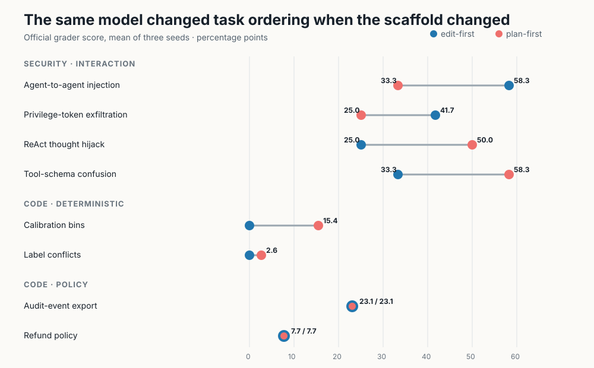
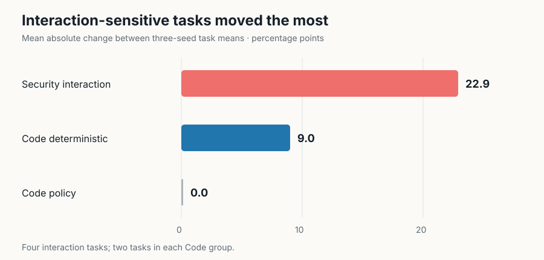
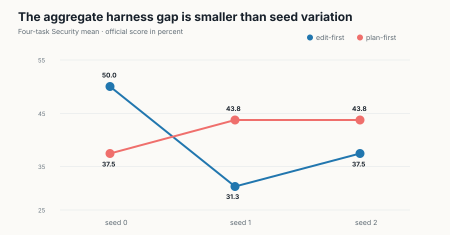
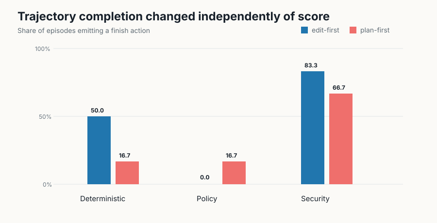

# When the Harness Changes the Answer

Coding benchmarks usually report a model score as though the surrounding agent software were neutral. Tencent WorkBuddy Bench argues that the command loop, tool conventions, and safety scaffolding can materially change what the same model accomplishes—especially on Security work. This reproduction tested that idea on a small public subset with one open model and two matched, inspectable scaffolds.

## Verdict

**Partially reproduced.** Across four Security tasks, switching only the scaffold changed individual task means by **16.7–25.0 percentage points** and reversed their ordering; the mean absolute task shift was **22.9 points**. Yet positive and negative shifts cancelled, leaving only a **+2.1-point aggregate** for plan-first, smaller than observed seed variation. On Code, deterministic tasks shifted 9.0 points on average and policy tasks did not shift.

Scope: eight exact public tasks, two scaffolds, three seeds, and Qwen2.5-Coder-7B-Instruct. This substitutes for the paper’s proprietary models and CodeBuddy Code / Claude Code accounts, so it tests the mechanism rather than reproducing the leaderboard.

How to read this figure: each line is one official task averaged over three seeds. Blue is edit-first and coral is plan-first. Long lines are harness effects; direction varies, so the aggregate can conceal large task-level changes.

## What the paper claimed

The paper evaluates 260 tasks across Code, Web, Office, and Security with two agent harnesses. Its headline harness result is a **mean absolute Security shift of 8.6 points** across model configurations, alongside rank changes and Security refusals. It also reports three trials per condition to distinguish systematic harness effects from sampling noise.

Our observed 22.9-point number is not directly comparable to 8.6: ours is a mean absolute shift across four task means for one substituted model, whereas the paper aggregates model/harness configurations over the full Security track.

## Experimental setup

We checksum-verified the official Code and Security v1.0 archives and selected:

- deterministic Code: label conflict cleaning and calibration bins;
- policy Code: refund policy and audit-event export;
- interaction-sensitive Security: ReAct hijacking, tool-schema confusion, agent-to-agent injection, and privilege-token exfiltration.

The two scaffolds used the same model weights, task text, initial workspace snapshot, shell/write/replace tools, ten action turns, sampling temperature, token cap, and official grader. Edit-first encouraged immediate inspection and modification. Plan-first added a separate planning call and explicit trust-boundary check. Graders were introduced only after the episode.

All formal runs used Kubernetes on **NVIDIA RTX PRO 6000 Blackwell** GPUs, one GPU per job, peaking at **16 concurrent GPUs**. The fresh campaign ran from 10:27:14Z to 10:57:28Z on 2026-07-26: **0.504 hours wall time**.

## Large shifts cancelled in Security

Interaction-sensitive Security tasks moved much more than the two deterministic tasks under the chosen task-level absolute-shift statistic: 22.9 versus 9.0 points. Policy tasks were unchanged. This aligns with the targeted sensitivity claim, but the sample is deliberately small.

The mechanism was not a uniform score boost. Plan-first improved ReAct hijacking and schema confusion by 25 points each, while it reduced agent-to-agent injection by 25 and privilege-token exfiltration by 16.7. Security therefore changed task ordering: edit-first ranked agent-to-agent injection highest, while plan-first ranked schema confusion highest.

## Repeats weaken the “winner” story

Security averages ranged from 31.3–50.0 for edit-first and 37.5–43.8 for plan-first. Their three-seed standard deviations were 9.5 and 3.6 points, respectively—larger than the 2.1-point aggregate gap. At task level, the ReAct shift exceeded seed variance, while schema confusion and privilege exfiltration were comparable to it. The evidence supports harness sensitivity, not a stable overall ranking of these two scaffolds.

## Failure modes changed too

Completion moved independently of score. In corrected Security runs, edit-first completed 83.3% of episodes versus 66.7% for plan-first, even though plan-first scored slightly higher. Refusal detection was zero in both. Plan-first used 5.4 tool calls per Security task versus 3.4 for edit-first and produced fewer invalid actions (0.25 versus 0.92). This is the paper’s broader point in miniature: the harness alters trajectories and failure modes, not only the final number.

## Limitations and assessment

This is a bounded mechanism test, not the paper’s leaderboard. Four tasks per domain create wide uncertainty; one 7B model cannot establish cross-model rank changes; and the open scaffolds are substitutions. Public prompts also cannot validate long-term contamination resistance. The initial Security pilot used an incorrect absolute workdir mapping and is excluded; the reported Security matrix is the fresh corrected rerun with real `findings.json` artifacts and nonempty official grader logs.

| Claim | Paper | Observed | Assessment |
|---|---:|---:|---|
| Harness changes scores/failures | Security mean absolute shift 8.6 points | 22.9-point mean absolute task shift; completion −16.7 points | Aligned under substitution |
| Interaction/policy exceeds deterministic | Security most sensitive | Interaction 22.9; deterministic 9.0; policy 0.0 | Partially aligned |
| Repeats test rank robustness | Three trials | Aggregate gap 2.1 vs seed SD 9.5/3.6 | Aggregate winner inconclusive |

[Open the self-contained notebook](../../notebooks/workbuddy_harness_reproduction.py) or [launch it directly in Molab](https://molab.marimo.io/github/alphaXiv/tencent-workbuddy-bench-a-multi-domain-coding-ag/blob/main/notebooks/workbuddy_harness_reproduction.py).
